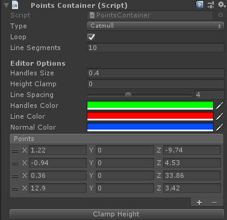
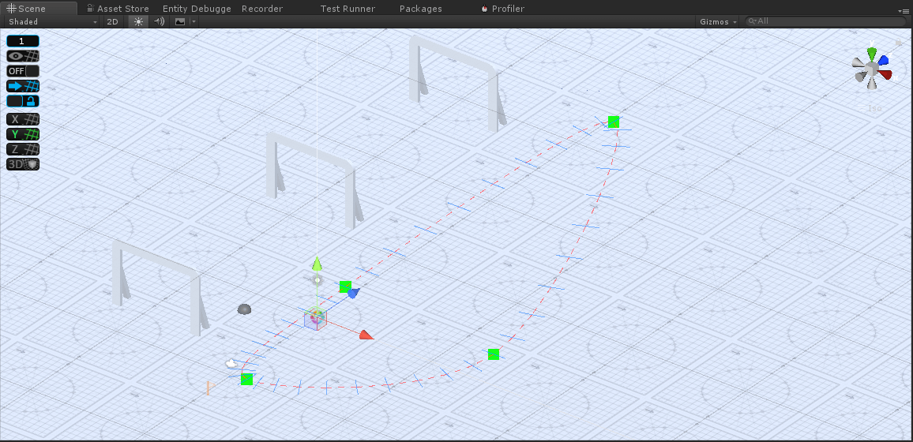

# Spline Tools #

This repo represents a set of tools to generate representation of splines and curves to render within Unity. Currently, the 
tool can generate and store a collection of sampled points along a CatmullRomSpline.

More spline types are to come!

## QuickStart ##
Simply attach a `PointsContainer` to any gameObject and create points.



### Fields ###
* Type:         The kind of spline to generate
* Loop:         Should the spline loop?
* LineSegments: How many segments should each subspline be splitted into?
* HandlesSize:  The size of the movement handles within the Scene
* HeightClamp:  What should the heights of all spline be?
* LineSpacing:  The far should the space between each line segment be for the preview?
* HandlesColor: The color of the handles.
* LineColor:    The color of the preview lines.
* NormalColor:  The color of the preview normals.
* Points:       The series of control points to generated the spline.

### SceneView ###


## Dependencies ##
* Unity
* C# 7.2
* .NET4.6

### Upgrading to C# 7 ###
In Player Settings, ensure your

* Scripting Runtime Version is .NET 4.x Equivalent
* Api Compatibility Level is .NET 4.x

If you're having compilation errors, in your `*.csproj` files try editing from

```
<PropertyGroup>
  <LangVersion>6</LangVersion>
</PropertyGroup>
```

to:
```
<PropertyGroup>
  <LangVersion>latest</LangVersion>
</PropertyGroup>
```

You can replace ***latest*** with ***7*** if you chose to do so.

## Notes ##
This is an experimental repo for me to explore so expect optimizations and refactors. I do use C# 7, so Unity should be targetted 
on the .NET 4.6 runtime instead of 3.5.

### Potential Uses ###
* Road generation/previews

### Limitations ###
Only looped CatmullRom Splines have array buffers which are properly calculated. If you want to write to a buffer for non looped 
CatmullRom Splines, use an `IList<Vector3>` instead. You should have enough points to generate the splines.

## Immediate Goals ##
* [ ] Tests to check the math of creating buffers `[In Progress]`
* [ ] Safety checking
* [ ] Burst compiler ready

## Potential Future Goals ##
* [ ] Procedural mesh generation
* [ ] Editor Windows
